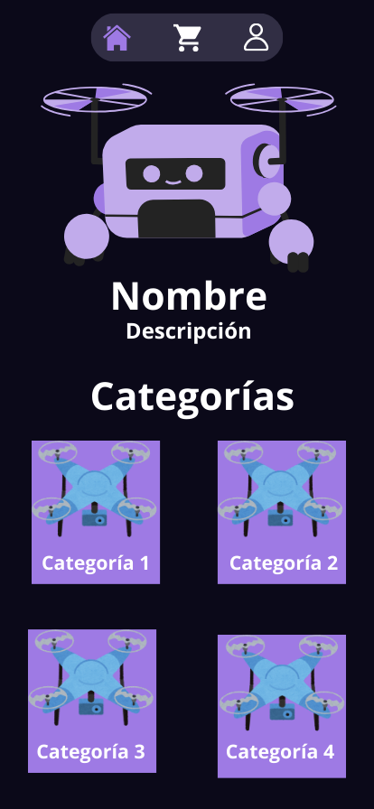
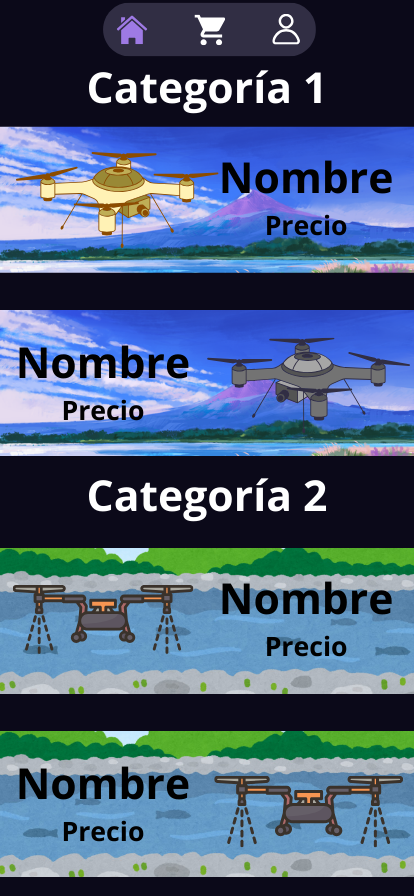
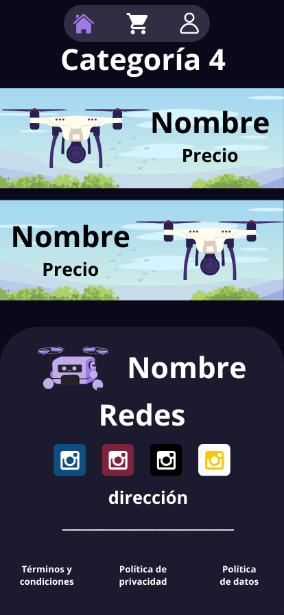
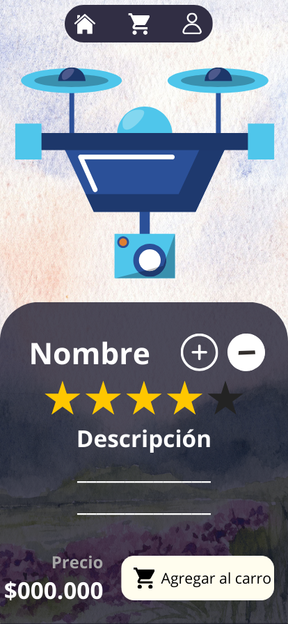
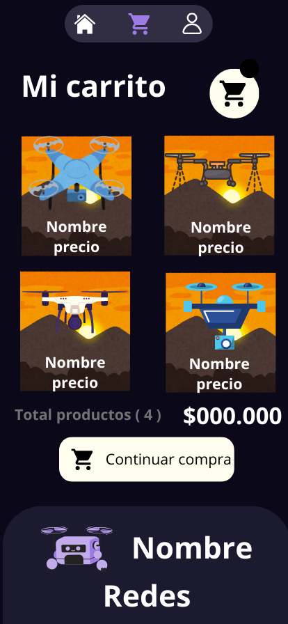
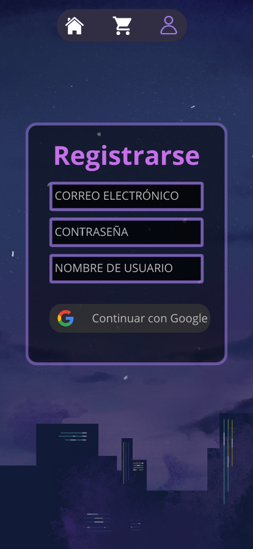

## Table of Contents
1. [General Info](#general-info)
2. [Project status](#status)
3. [explanation](#explanation)
4. [Technologies](#Technologies)

### General Info
***
This is a project to create an e-commerce website focused on drones, the pages are designed exclusively for mobile devices,focused on the sale of drones of different categories and prices.
### Status
The **principal structure** of the project is **finished**, except for adding some extra pages, such as a section where data is requested to make the purchase
### Explanation
***

1. We can see the **home page** which is composed by a **navigation bar** at the top to navigate between three pages 
* Home, the page we are currently on so it is highlighted.
* Cart
* User

You will find the **logo**, with the **project name** and a brief **introduction** to give context, together with the **four categories** of drones where if you *click* the page below will show the products that you choose
***

2. The **Name of the categories** with two **example products**, with a background image, image of the drone name and price, if clicked redirects to the page of that drone.
***

3. Fourth category of the **home** page and the **footer** where the **logo**, **title**, **social networks**, **address**, and **legal documents of the site** are located.
***

4. Example of a respective product page, where the product appears in the upper half (in pc), and below is a block with **name** **add or remove units** **stars** **description** **price** **add to cart button**.
***

5. The **cart**, where if you **click the products they move vertically** to reveal a delete button, **total products**, **total price relative to the products** and **continue shopping button (not functional)* with a part of the **footer** below.
***

6. Structure of registration page, with **email** **username** **password** or the option to *continue with google**.
***
## Technologies
***
A list of technologies used within the project:
* [HTML]
* [CSS]
* [Visual_Studio_Code]
## installation
***
To follow a proper continuity order although not necessary, you should first open the html file called **index.html** either with the **Live Server** extension of **visual studio code** or by running the **.html file**
